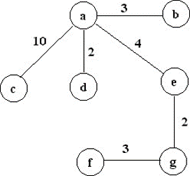

# Lecture 19: Minimum Spanning Tree

>Note: The most of the information of these lectures was extracted and adapted from Dr Bajuelos and from Weiss’s book, “Data Structures and Algorithm Analysis in Java". They are provided for COP3530 students only. Not to be published or publicly distributed without permission by the publisher. 

## Definition

A Minimum Spanning Tree (MST) of an undirected connected weighted graph G is a tree formed from graph edges that connects <u>all the vertices of G at lowest total cost</u>.


A minimum spanning tree is a special kind of tree that minimizes the lengths (or “weights”) of the edges of the tree. An example is a cable company wanting to lay line to multiple neighborhoods; by minimizing the amount of cable laid, the cable company will save money. A tree has one path joins any two vertices.

## Notes

Given an undirected connected graph G = <V,E>, find a graph G'=<V,E'>  such that:
* E' ∈ E
* \|E'\| = \|V\| - 1
* G' is connected
* G' is a ST (or Spanning Tree) 

Note that:
* For any spanning tree T, if an edge e that is not in T is added, a cycle is created. 


If, as a spanning tree is created, 
* then the edge that is added is the one of minimum cost that avoids creation of a cycle, then 
* the cost of the resulting spanning tree cannot be improved, because any replacement edge would have cost at least as much as an edge already in the spanning tree.

## MST may be not unique!


## Applications

Minimum-cost spanning trees have many applications.

Examples:
* Building cable networks that join n locations with minimum cost.
* Building a road network that joins n cities with minimum cost.
* Obtaining an independent set of circuit equations for an electrical network.
* In pattern recognition minimal spanning trees can be used to find noisy pixels.

## Prim’s Algorithm to find the MST

Based on expanding cloud of known vertices (greedy strategy)

Basic ideas:

Prim’s algorithm finds a MST by selecting edges from the graph one-by-one as follows:
* It starts with a tree, T, consisting of the starting vertex, v, (v is any vertex in V)
* Then, it adds the shortest edge (= edge with a minimum-cost) emanating from v that connects T to the rest of the graph.
* It then moves to the added vertex and repeats the process.

### Pseudocode


General Pseudocode:
```text
Consider a graph G = (V,E,W);
T: a tree consisting of only the starting vertex v;
while (T has fewer than |V| vertices)
{
    e  find a smallest edge connecting T to G\T;
    add e to T;
}
```


## Full pseudocode of Prim’s Algorithm
```text
For each vertex v, set:
	v.cost = ∞ and v.known = false

Choose any vertex v 

Mark v as known

For each edge (v,u) with weight w, set:
	u.cost=w and u.prev=v

While there are unknown vertices in G
    Select the unknown vertex v with lowest cost
    Mark v as known and add the edge (v, v.prev) to output
    For each edge (v,u) with weight w,
	    if(w < u.cost)
        {
		    u.cost = w;
	        u.prev = v;
	    }

```


The running time is O(\|V\|<sup>2</sup>) without heaps, optimal for dense graphs, and O(\|E\|log\|V\|) using binary heaps, good for sparse graphs.

## Kruskal’s Algorithm

As a Prim’s algorithm this method is based on expanding cloud of known vertices (greedy strategy)
The Basic idea of the Kruskal’s algorithm is:
Continually to select the edges in order of smallest weight
Accept an edge if it does not cause a cycle. 

General Pseudocode:
```text
Sort edges by weight (better: put in min-heap)
T = empty
While output size < |V|-1
{
Consider next smallest edge, e = (u,v)
if(e does not create a cycle with edges in T)
    add e to T
}
```

Non-trivial fact:

The worst-case running time of this algorithm is O(\|E\|log\|E\|), which is dominated by the sort operations.


## Example


The resulting MST is: 





## Observations:

At each step of the Kruskal’s algorithm T is acyclic.

If u and v are previously in T, then adding the edge (u,v) to T creates a cycle. 

Question: 

How to test whether u and v are in the same set?

Answer: 

Trivial algorithm: O(\|V\|).

Non-trivial:

Use a disjoint-set data structure! Vertices in T are considered to be in same set.

Test if Find-set(u) = Find-set(v)??

Find-set(u) is O(log n), where n is the size of the set.

## Link:

https://www.techiedelight.com/kruskals-algorithm-for-finding-minimum-spanning-tree/


## Implementation Kurshak
```java
import java.util.*;
 
// A class to store a graph edge
class Edge
{
    int src, dest, weight;
 
    public Edge(int src, int dest, int weight)
    {
        this.src = src;
        this.dest = dest;
        this.weight = weight;
    }
 
    @Override
    public String toString() {
        return "(" + src + ", " + dest + ", " + weight + ")";
    }
}
 
// A class to represent a disjoint set
class DisjointSet
{
    Map<Integer, Integer> parent = new HashMap<>();
 
    // perform MakeSet operation
    public void makeSet(int n)
    {
        // create `n` disjoint sets (one for each vertex)
        for (int i = 0; i < n; i++) {
            parent.put(i, i);
        }
    }
 
    // Find the root of the set in which element `k` belongs
    private int find(int k)
    {
        // if `k` is root
        if (parent.get(k) == k) {
            return k;
        }
 
        // recur for the parent until we find the root
        return find(parent.get(k));
    }
 
    // Perform Union of two subsets
    private void union(int a, int b)
    {
        // find the root of the sets in which elements `x` and `y` belongs
        int x = find(a);
        int y = find(b);
 
        parent.put(x, y);
    }
 
    // Function to construct MST using Kruskal’s algorithm
    public static List<Edge> runKruskalAlgorithm(List<Edge> edges, int n)
    {
        // stores the edges present in MST
        List<Edge> MST = new ArrayList<>();
 
        // Initialize `DisjointSet` class.
        // create a singleton set for each element of the universe.
        DisjointSet ds = new DisjointSet();
        ds.makeSet(n);
 
        int index = 0;
 
        // sort edges by increasing weight
        Collections.sort(edges, Comparator.comparingInt(e -> e.weight));
 
        // MST contains exactly `V-1` edges
        while (MST.size() != n - 1)
        {
            // consider the next edge with minimum weight from the graph
            Edge next_edge = edges.get(index++);
 
            // find the root of the sets to which two endpoints
            // vertices of the next edge belongs
            int x = ds.find(next_edge.src);
            int y = ds.find(next_edge.dest);
 
            // if both endpoints have different parents, they belong to
            // different connected components and can be included in MST
            if (x != y)
            {
                MST.add(next_edge);
                ds.union(x, y);
            }
        }
 
        return MST;
    }
}
 
class Main
{
    public static void main(String[] args)
    {
        // (u, v, w) triplet represent undirected edge from
        // vertex `u` to vertex `v` having weight `w`
        List<Edge> edges = Arrays.asList(
                new Edge(0, 1, 7), new Edge(1, 2, 8), new Edge(0, 3, 5),
                new Edge(1, 3, 9), new Edge(1, 4, 7), new Edge(2, 4, 5),
                new Edge(3, 4, 15), new Edge(3, 5, 6), new Edge(4, 5, 8),
                new Edge(4, 6, 9), new Edge(5, 6, 11));
 
        // total number of nodes in the graph (labelled from 0 to 6)
        int n = 7;
 
        // construct graph
        List<Edge> e = DisjointSet.runKruskalAlgorithm(edges, n);
        System.out.println(e);
    }
}

```

## Class Problem

Find the minimum spaning tree for this graph.


